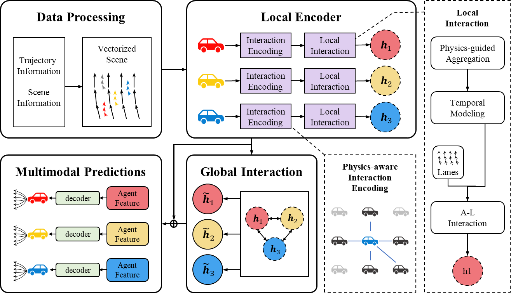
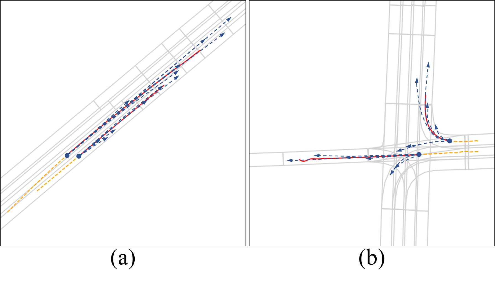
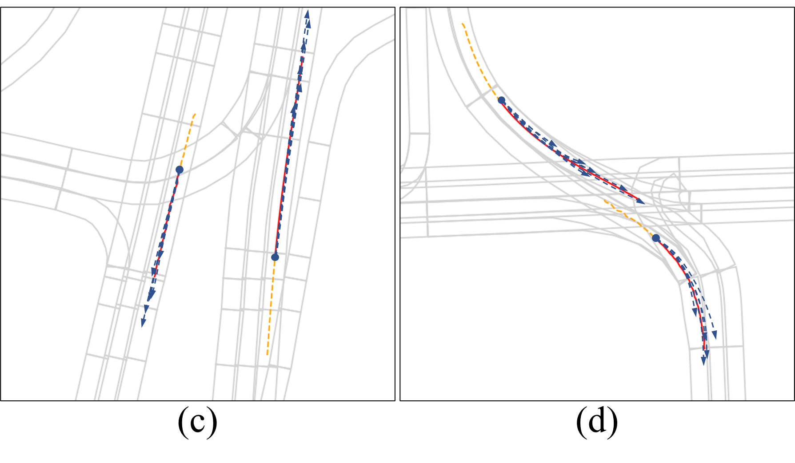

# PLMT-Net：A Physics-aware Lightweight Network for Multiagent Trajectory Prediction in Interactive Driving Scenarios
In this work, we propose a lightweight trajectory prediction framework that integrates physical information to enhance interaction modeling and runtime performance.



## Gettting Started

1\. Clone this repository:
```
git clone https://github.com/image-Q/PLMT-Net.git
cd PLMT-Net
```

2\. Create a conda environment and install the dependencies:
```
conda create -n PLMT-Net python=3.8
conda activate PLMT-Net
conda install pytorch==1.8.0 cudatoolkit=11.1 -c pytorch -c conda-forge
conda install pytorch-geometric==1.7.2 -c rusty1s -c conda-forge
conda install pytorch-lightning==1.5.2 -c conda-forge
```

3\. Download [Argoverse Motion Forecasting Dataset v1.1](https://www.argoverse.org/av1.html). After downloading and extracting the tar.gz files, the dataset directory should be organized as follows:
```
/path/to/dataset_root/
├── train/
|   └── data/
|       ├── 1.csv
|       ├── 2.csv
|       ├── ...
└── val/
    └── data/
        ├── 1.csv
        ├── 2.csv
        ├── ...
```

4\. Install [Argoverse 1 API](https://github.com/argoai/argoverse-api).

## Training

To train PLMT-Net:
```
python train.py --root /path/to/dataset_root/ --embed_dim 64
```

During training, the checkpoints will be saved in `lightning_logs/` automatically. To monitor the training process:
```
tensorboard --logdir lightning_logs/
```

## Evaluation

To evaluate the prediction performance:
```
python eval.py --root /path/to/dataset_root/ --batch_size 32 --ckpt_path /path/to/your_checkpoint.ckpt
```

## Results

### Quantitative Results

For this repository, the expected performance on Argoverse 1.1 validation set is:

| Models | minADE | minFDE | MR |Param|
| :--- | :---: | :---: | :---: |:---:|
| PLMT-Net | 0.67 | 1.02 | 0.09 |652K|
| HiVT | 0.69 | 1.03 | 0.10 |662K|
| LaneGCN | 0.71 | 1.08 | 0.10 |3701K|
| DenseTNT | 0.75 | 1.05 | 0.10 |1103K|

### Qualitative Results



## Citation

@inproceedings{zhou2022hivt,
  title={HiVT: Hierarchical Vector Transformer for Multi-Agent Motion Prediction},
  author={Zhou, Zikang and Ye, Luyao and Wang, Jianping and Wu, Kui and Lu, Kejie},
  booktitle={Proceedings of the IEEE/CVF Conference on Computer Vision and Pattern Recognition (CVPR)},
  year={2022}
}

If you found this repository useful, please consider citing our work:

```
@inproceedings{zhou2022hivt,
  title={PLMT-Net: A Physics-aware Lightweight Network for Multi-agent Trajec-tory Prediction in Interactive Driving Scenarios},
  author={Wan Y, Fu L,H L,L Z,M C},
}
```

## License

This repository is licensed under [Apache 2.0](LICENSE).

